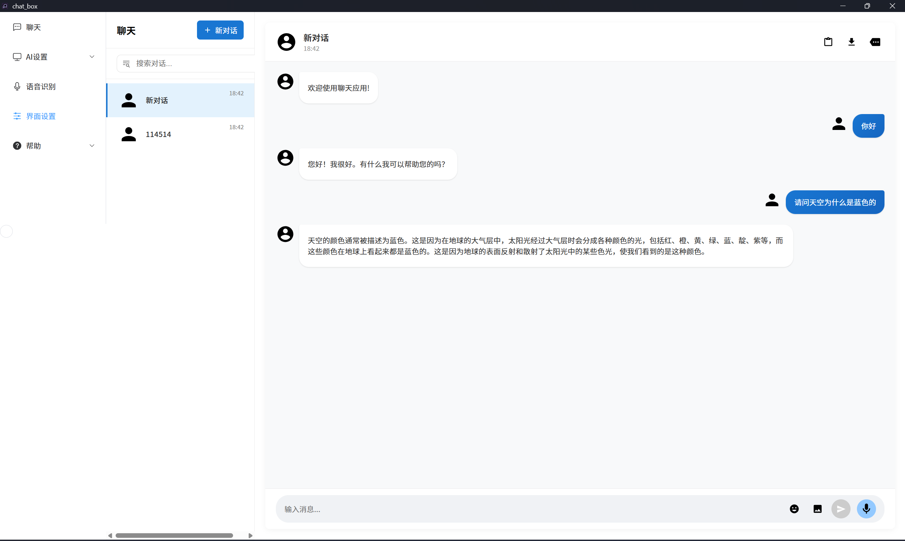

# 聊天盒子
# Chat Box Rust

<!-- PROJECT SHIELDS -->

[![Contributors][contributors-shield]][contributors-url]
[![Forks][forks-shield]][forks-url]
[![Stargazers][stars-shield]][stars-url]
[![Issues][issues-shield]][issues-url]
[![MIT License][license-shield]][license-url]
[![LinkedIn][linkedin-shield]][linkedin-url]
[](https://deepwiki.com/Horldsence/chat_box_rust)

<!-- PROJECT LOGO -->
<br />

<p align="center">
  <a href="https://github.com/horldsence/chat_box_rust/">
    
  </a>

  <h3 align="center">Chat_Box_Rust</h3>
  <p align="center">
    由rust构建的跨平台高性能聊天应用
    <br />
    <a href="https://github.com/horldsence/chat_box_rust"><strong>探索本项目的文档 »</strong></a>
    <br />
    <br />
    <a href="https://github.com/horldsence/chat_box_rust">查看Demo</a>
    ·
    <a href="https://github.com/horldsence/chat_box_rust/issues">报告Bug</a>
    ·
    <a href="https://github.com/horldsence/chat_box_rust/issues">提出新特性</a>
  </p>

</p>


> 本篇README.md面向开发者

基于 Tauri、Vue3 和 Rust 构建的现代化桌面 AI 聊天应用，支持多平台部署，包括 RISC-V 架构。



## 目录

- 项目概述
- 特性
- 技术栈
- 开始使用
  - 前提条件
  - 标准安装
  - RISC-V 环境配置
- 使用指南
- 项目结构
- 路线图
- 贡献
- 许可证
- 联系方式
- 致谢

## 项目概述

聊天盒子是一款本地优先的 AI 对话应用，旨在提供安全、高效且易用的人机交互体验。通过集成大语言模型，用户可进行自然语言对话，同时享受现代化界面与流畅交互。项目特别优化了在 RISC-V 架构上的性能，为新一代计算平台提供原生支持。

## 特性

- 📝 多对话管理与历史记录
- 🔊 语音输入与实时语音转文本
- 🖥️ Material You 设计的现代化界面
- 📊 Markdown 格式支持与代码高亮
- 🏎️ 流式响应，实时显示 AI 回复
- 🛡️ 本地优先，保护数据隐私
- 🌍 跨平台支持，包括 RISC-V 架构

## 技术栈

- **前端**: Vue 3 + TypeScript + Vite
- **后端**: Rust + Tauri
- **数据存储**: SQLite
- **AI 模型**: 支持 Ollama 框架下的大语言模型

## 开始使用

### 前提条件

- [Node.js](https://nodejs.org/) (>= 16.0.0)
- [Rust](https://www.rust-lang.org/) (>= 1.60.0)
- [Tauri 开发环境](https://tauri.app/v1/guides/getting-started/prerequisites)

### 标准安装

1. 克隆仓库

```bash
git clone https://github.com/horldsence/chat_box_rust.git
cd chat_box_rust
```

2. 安装依赖

```bash
npm install
```

3. 安装 Ollama (x86/AMD64 环境)

```bash
curl -fsSL https://ollama.com/install.sh | sh
```

4. 开发模式运行

```bash
npm run tauri dev
```

5. 构建应用

```bash
npm run tauri build
```

### RISC-V 环境配置

在 RISC-V 架构上，需要特别注意以下几点：

#### 1. 系统要求

- RISC-V 64 架构处理器
- 至少 4GB RAM
- 支持 RISC-V 的 Linux 发行版 (如 Debian riscv64, Fedora riscv64)

#### 2. Rust 工具链安装

```bash
curl --proto '=https' --tlsv1.2 -sSf https://sh.rustup.rs | sh
# 选择默认安装选项
source $HOME/.cargo/env
```

#### 3. 前端依赖安装

```bash
# 确保安装了 Node.js RISC-V 版本
npm install
```

#### 4. Ollama 手动编译安装 (RISC-V 特别步骤)

由于 Ollama 官方暂未提供 RISC-V 预编译包，需要从源码编译：

```bash
# 安装必要的依赖
sudo apt-get update
sudo apt-get install -y build-essential git cmake golang-go

# 克隆 Ollama 源码
git clone https://github.com/ollama/ollama.git
cd ollama

# 编译 Ollama (可能需要调整 GOARCH 参数)
go build -o ollama cmd/ollama/main.go

# 安装到系统路径
sudo cp ollama /usr/local/bin/
```

#### 5. RISC-V 下的特别优化

```bash
# 在项目目录下创建 RISC-V 优化配置
cat > .cargo/config.toml << EOF
[target.riscv64gc-unknown-linux-gnu]
rustflags = ["-C", "target-cpu=native"]
EOF
```

#### 6. 构建与运行

```bash
# RISC-V 环境下构建
npm run tauri build -- --target riscv64gc-unknown-linux-gnu

# 运行已构建的应用
./src-tauri/target/riscv64gc-unknown-linux-gnu/release/chat-box
```

## 使用指南

1. **创建新对话**: 点击左侧面板"+"按钮创建新对话
2. **消息交互**: 在输入框中输入问题，按发送按钮或回车键提交
3. **语音输入**: 点击麦克风图标开始语音输入
4. **管理对话**: 选择、重命名或删除左侧面板中的对话
5. **配置设置**: 通过设置面板调整 AI 模型、界面和语音参数

查看完整文档了解更多功能。

## 项目结构

```
chat_box_rust/
├── src/                       # 前端代码
│   ├── components/           # Vue组件
│   ├── styles/               # 样式文件
│   └── utils/                # 工具函数
├── src-tauri/                # Tauri后端代码
│   ├── database/             # 数据库相关
│   └── src/                  # Rust源代码
```

## 路线图

- [ ] 支持更多大语言模型
- [ ] 完善 RISC-V 架构下的性能调优
- [ ] 添加文本转语音功能
- [ ] 优化离线模式体验
- [ ] 增加插件系统

查看[open issues](https://github.com/horldsence/chat_box_rust/issues)获取更多信息。

## 贡献

贡献使开源社区成为学习、启发和创造的绝佳场所。非常感谢您的任何贡献！

1. Fork 项目
2. 创建功能分支 (`git checkout -b feature/AmazingFeature`)
3. 提交更改 (`git commit -m 'Add some AmazingFeature'`)
4. 推送到分支 (`git push origin feature/AmazingFeature`)
5. 开启 Pull Request

## 许可证

本项目采用 MIT 许可证 - 详情请查看 LICENSE 文件。

## 联系方式

项目维护者: Peng - horldjason@outlook.com

项目链接: [https://github.com/horldsence/chat_box_rust](https://github.com/horldsence/chat_box_rust)

## 致谢

- [Tauri](https://tauri.app/)
- [Vue.js](https://vuejs.org/)
- [Rust](https://www.rust-lang.org/)
- [Ollama](https://ollama.com/)
- [RISC-V 基金会](https://riscv.org/)

<!-- links -->
[your-project-path]:horldsence/chat_box_rust
[contributors-shield]: https://img.shields.io/github/contributors/horldsence/chat_box_rust.svg?style=flat-square
[contributors-url]: https://github.com/horldsence/chat_box_rust/graphs/contributors
[forks-shield]: https://img.shields.io/github/forks/horldsence/chat_box_rust.svg?style=flat-square
[forks-url]: https://github.com/horldsence/chat_box_rust/network/members
[stars-shield]: https://img.shields.io/github/stars/horldsence/chat_box_rust.svg?style=flat-square
[stars-url]: https://github.com/horldsence/chat_box_rust/stargazers
[issues-shield]: https://img.shields.io/github/issues/horldsence/chat_box_rust.svg?style=flat-square
[issues-url]: https://img.shields.io/github/issues/horldsence/chat_box_rust.svg
[license-shield]: https://img.shields.io/github/license/horldsence/chat_box_rust.svg?style=flat-square
[license-url]: https://github.com/horldsence/chat_box_rust/blob/master/LICENSE.txt
[linkedin-shield]: https://img.shields.io/badge/-LinkedIn-black.svg?style=flat-square&logo=linkedin&colorB=555
[linkedin-url]: https://linkedin.com/in/shaojintian
