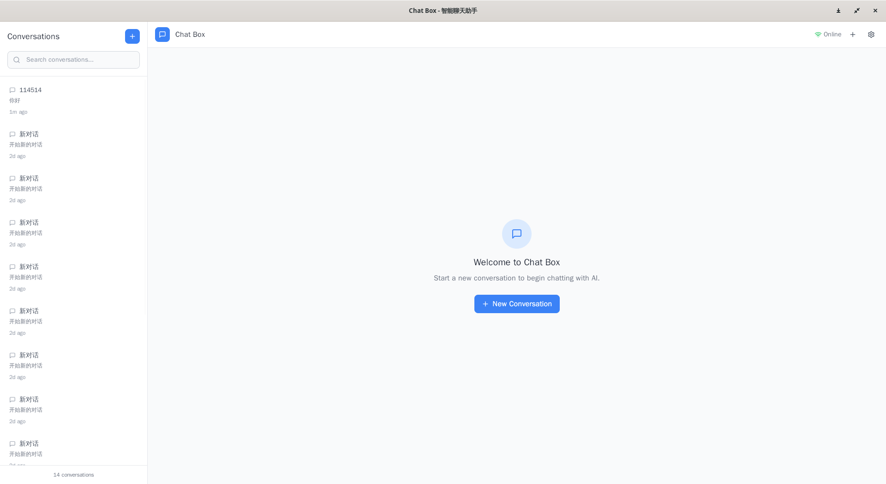

# Chat Box Rust React

*[English](README.md) | [中文](README-CN.md)*

<!-- PROJECT SHIELDS -->

[![Contributors][contributors-shield]][contributors-url]
[![Forks][forks-shield]][forks-url]
[![Stargazers][stars-shield]][stars-url]
[![MIT License][license-shield]][license-url]
<!-- [![LinkedIn][linkedin-shield]][linkedin-url] -->
[](https://deepwiki.com/Horldsence/chat_box_rust)

<!-- PROJECT LOGO -->
<br />

<p align="center">
  <a href="https://github.com/horldsence/chat_box_rust/">
    
  </a>

  <h3 align="center">Chat Box Rust React</h3>
  <p align="center">
    A cross-platform high-performance AI chat application built with Rust and React
    <br />
    <a href="https://github.com/horldsence/chat_box_rust"><strong>Explore the documentation »</strong></a>
    <br />
    <br />
    <a href="https://github.com/horldsence/chat_box_rust">View Demo</a>
    ·
    <a href="https://github.com/horldsence/chat_box_rust/issues">Report Bug</a>
    ·
    <a href="https://github.com/horldsence/chat_box_rust/issues">Request Feature</a>
  </p>
</p>



> This README is designed for developers

A modern desktop AI chat application built with Tauri, React, and Rust, supporting multi-platform deployment and local AI models.

## Table of Contents

- [Project Overview](#project-overview)
- [Features](#features)
- [Tech Stack](#tech-stack)
- [Getting Started](#getting-started)
  - [Prerequisites](#prerequisites)
  - [Standard Installation](#standard-installation)
- [Usage Guide](#usage-guide)
- [Project Structure](#project-structure)
- [Recent Updates](#recent-updates)
- [Configuration](#configuration)
- [Language Support](#language-support)
- [Roadmap](#roadmap)
- [Contributing](#contributing)
- [License](#license)
- [Contact](#contact)
- [Acknowledgments](#acknowledgments)

## Project Overview

Chat Box Rust React is a local-first AI conversation application designed to provide secure, efficient, and user-friendly human-AI interaction. By integrating large language models, users can engage in natural language conversations while enjoying a clean, minimal interface and smooth interactions. The application supports both local and remote AI models while maintaining high performance and responsiveness.

## Features

- 🌟 **Clean, Minimal UI** for distraction-free experience
- 📝 Multi-conversation management with chat history
- 🔊 Voice input with real-time speech-to-text
- 📊 Markdown format support with code highlighting
- 🏎️ Streaming responses with real-time AI replies
- 🛡️ Local-first approach protecting data privacy
- 🌍 Cross-platform support
- 🔧 Multiple AI backend support (Ollama & Candle)
- 💾 SQLite database for conversation storage
- 🎨 React with Tailwind CSS for modern styling

## Tech Stack

- **Frontend**: React + TypeScript + Vite + Tailwind CSS
- **Backend**: Rust + Tauri
- **Data Storage**: SQLite
- **AI Frameworks**:
  - Ollama (for remote/local model serving)
  - Candle (for native Rust AI inference)
- **Voice Processing**: Vosk (speech recognition)

## Getting Started

### Prerequisites

- [Node.js](https://nodejs.org/) (>= 16.0.0)
- [Rust](https://www.rust-lang.org/) (>= 1.60.0)
- [Tauri Development Environment](https://tauri.app/v1/guides/getting-started/prerequisites)

### Standard Installation

1. Clone the repository

```bash
git clone https://github.com/horldsence/chat_box_rust.git
cd chat-box-rust-react
```

2. Install dependencies

```bash
npm install
# or
pnpm install
```

3. Run in development mode

```bash
npm run tauri dev
# or
pnpm tauri dev
```

4. Build the application

```bash
npm run tauri build
# or
pnpm tauri build
```

## Usage Guide

1. **Create New Conversation**: Click the "+" button in the left panel to create a new conversation
2. **Message Interaction**: Type your question in the input box, then press send button or Enter key
3. **Voice Input**: Click the microphone icon to start voice input
4. **Manage Conversations**: Select, rename, or delete conversations in the left panel
5. **Configure Settings**: Adjust AI models, interface, and system parameters through the settings panel

See the complete documentation for more features.

## Project Structure

```
chat-box-rust-react/
├── src/                      # Frontend code
│   ├── components/           # React components
│   ├── hooks/                # Custom React hooks
│   ├── types/                # TypeScript type definitions
│   ├── utils/                # Utility functions
│   └── assets/               # Static assets
├── src-tauri/                # Tauri backend code
│   ├── crates/               # Rust workspace crates
│   │   ├── agent/           # AI agent implementation
│   │   └── initialize/      # Initialization logic
│   └── src/                  # Main Rust source code
│       ├── commands/         # Tauri commands
│       ├── services/         # Backend services
│       └── utils/            # Utility modules
└── package.json              # Node.js dependencies
```

## Recent Updates

### UI Redesign
- Complete UI overhaul with clean, minimal design
- Improved usability and reduced visual clutter
- Better responsiveness for different screen sizes
- Enhanced accessibility features
- More consistent styling throughout the application

### Bug Fixes
- Fixed API command parameter mismatch issues
- Improved message streaming functionality
- Fixed database message storage and retrieval
- Added debug tools for troubleshooting
- Enhanced error handling and logging

### Documentation
- Added comprehensive documentation
- Created debugging guides
- Improved code comments and API documentation
- Added various README files for different aspects of the project

## Configuration

The application uses configuration files for customization:

- `tailwind.config.js`: UI theming and styling configuration
- Environment configuration through Tauri's configuration mechanism
- Runtime settings through the Settings panel

### AI Model Configuration

- **Multiple Model Support**: Use various AI models based on your needs
- **Local Inference**: Use Candle for Rust-native AI inference with Hugging Face models
- **Remote Inference**: Connect to external AI services for more powerful models

## Language Support

Chat Box Rust React provides documentation in multiple languages:

- [English (README.md)](README.md)
- [中文 (README-CN.md)](README-CN.md)

The application interface also supports multiple languages which can be configured in the settings.

## Roadmap

- [ ] Support for more large language models
- [ ] Add text-to-speech functionality
- [ ] Enhance offline mode experience
- [ ] Implement plugin system
- [ ] Multi-language interface support
- [ ] Cloud synchronization capabilities
- [ ] Document collaboration features

See [open issues](https://github.com/horldsence/chat_box_rust/issues) for more information.

## Contributing

Contributions make the open-source community an amazing place to learn, inspire, and create. Any contributions you make are **greatly appreciated**!

1. Fork the Project
2. Create your Feature Branch (`git checkout -b feature/AmazingFeature`)
3. Commit your Changes (`git commit -m 'Add some AmazingFeature'`)
4. Push to the Branch (`git push origin feature/AmazingFeature`)
5. Open a Pull Request

## License

This project is licensed under the MIT License - see the [LICENSE](LICENSE) file for details.

## Contact

Project Maintainer: Peng - horldjason@outlook.com

Project Link: [https://github.com/horldsence/chat_box_rust](https://github.com/horldsence/chat_box_rust)

## Acknowledgments

- [Tauri](https://tauri.app/) - For the excellent desktop app framework
- [React](https://reactjs.org/) - For the frontend library
- [Rust](https://www.rust-lang.org/) - For the powerful systems programming language
- [Ollama](https://ollama.com/) - For local LLM serving
- [Candle](https://github.com/huggingface/candle) - For Rust-native machine learning
- [Tailwind CSS](https://tailwindcss.com/) - For utility-first CSS framework

<!-- links -->
[your-project-path]:horldsence/chat_box_rust
[contributors-shield]: https://img.shields.io/github/contributors/horldsence/chat_box_rust.svg?style=flat-square
[contributors-url]: https://github.com/horldsence/chat_box_rust/graphs/contributors
[forks-shield]: https://img.shields.io/github/forks/horldsence/chat_box_rust.svg?style=flat-square
[forks-url]: https://github.com/horldsence/chat_box_rust/network/members
[stars-shield]: https://img.shields.io/github/stars/horldsence/chat_box_rust.svg?style=flat-square
[stars-url]: https://github.com/horldsence/chat_box_rust/stargazers
[issues-shield]: https://img.shields.io/github/issues/horldsence/chat_box_rust.svg?style=flat-square
[issues-url]: https://img.shields.io/github/issues/horldsence/chat_box_rust.svg
[license-shield]: https://img.shields.io/github/license/horldsence/chat_box_rust.svg?style=flat-square
[license-url]: https://github.com/horldsence/chat_box_rust/blob/master/LICENSE
